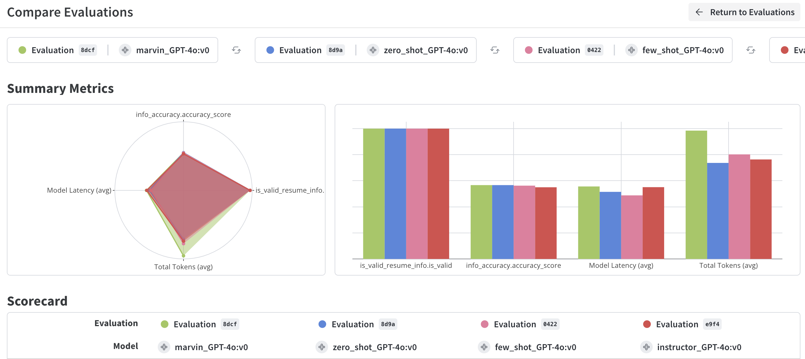

# UPDATE
OpenAI released their new structured output capability today (right as I finished my analysis, of course), so the code reflected in compare_models.ipynb is slightly different from the results presented in this readme. With this new feature of the OpenAI API, there doesn't seem to be any reason to use third party libraries like Instructor or Marvin (if using an OpenAI model).

# Testing LLM Structured Output Options



If you haven't had your fair share of headaches trying to get your LLM output to follow the structure you desire (say, JSON), then you haven't been in the game long enough!

This repository is dedicated to evaluating/comparing 4 options for structured Large Language Model (LLM) output using Weave. All options use GPT 4o as the base model:

1. Zero-shot (with JSON mode)
2. Few-shot (with JSON mode)
3. [Instructor](https://github.com/jxnl/instructor)
4. [Marvin](https://github.com/PrefectHQ/marvin)

They are compared against the following 4 metrics:

1. Latency
2. Tokens consumed
3. Completeness: whether the output adheres to the Pydantic BaseModel structure specified.
4. Accuracy: whether the values extracted are based on the context provided. I use an LLM as a judge here so take the result of this metric with a serving of salt.

Some further context: I have a directory of text files, each file containing text from a resume. I then feed this as input to the model with the goal of extracting structure information from the resume.

## Getting Started

To get started with the notebooks in this repository, follow these steps:

1. **Clone the repository:**
   ```sh
   git clone https://github.com/bassimeledath/test-llm-structured-output.git
   cd test-llm-structured-output
   ```

2. **Set up a virtual environment:**
   ```sh
    python -m venv venv
    source venv/bin/activate  # On Windows, use `venv\Scripts\activate`
   ```

3. **Install the required packages:**
   ```sh
    pip install -r requirements.txt
   ```

4. **Set up keys in environment:** 
Create a `.env` file with your `OPENAI_API_KEY="sk...".` You may additionally need a `WANDB_API_KEY` depending on how you set things up. Follow along here: [Weave docs](https://wandb.github.io/weave/quickstart)

5. **Run the Jupyter Notebook!**

## Results


## Findings

- GPT-4o's performance with zero-shot prompting is impressive at adhering to structure. The output can be unpacked and fed into an instance of `ResumeInfo` without issues. However, it is inconsistent in the formatting of values. For instance, it might extract the education of a user as “Duke BS, 2012-2016” in one case and “B.S. Duke, 2012-2016” in another. This inconsistency can only be resolved with few-shot prompting (or more explicit instructing).
- Instructor and Marvin work well out of the box, with added inference latency being negligible.
- Marvin is accurate but consumes many tokens. Instructor is efficient and very easy to implement.

## Verdict

- For most use cases, working with GPT-4o with the enabled JSON schema forcing parameter and few-shot examples should suffice. You may need additional logic to process the output of the completion API to enforce or cast string types to your desired type (e.g., casting age to an integer). If you're comfortable adding Instructor as a dependency, it is super easy to implement and is effective. Output structuring and forcing, which was super annoying with GPT-3.5-turbo, seems to be much better with these newer models, and this trend will likely continue.
- Weave is great for evaluations, especially for comparing different models. Highly recommend!

## Limitations of Analysis

- This analysis is limited to GPT-4o, a closed-source model. Several other python packages handle output structuring for open-source models in a more low-level manner. That is an analysis for another day. GPT-4o is a very good model, and I am interested in replicating this analysis with smaller open-source models.

[Link to Weave Dashboard](https://wandb.ai/bassimfaizal/compare-output-structuring-models/weave/compare-evaluations?evaluationCallIds=%5B%226634cff9-3d63-4748-9cf8-5c8a93778dcf%22%2C%22ce15da54-b232-411d-ba40-f620f223e9f4%22%2C%220a2ca30a-1579-475e-a150-fed93be50422%22%2C%22d810f8de-c1b1-4f0e-8323-8dae223c8d9a%22%5D)

**new**
[Link to Weave Dashboard with OpenAI structured output](https://wandb.ai/bassimfaizal/compare-output-structuring-models/weave/compare-evaluations?evaluationCallIds=%5B%22af7c3d54-0336-4d61-8bb6-2fad14fa3a85%22%2C%22f2828a71-f95d-4fec-9e73-5b6b414daa42%22%2C%22cbef3d38-9b00-4bc2-9fab-f3ce4dd47b5e%22%2C%2291b8a484-f5e2-4998-a608-4059e4ea0036%22%2C%22b1511f53-5d73-4c5a-8f90-688c71d208f4%22%5D)
